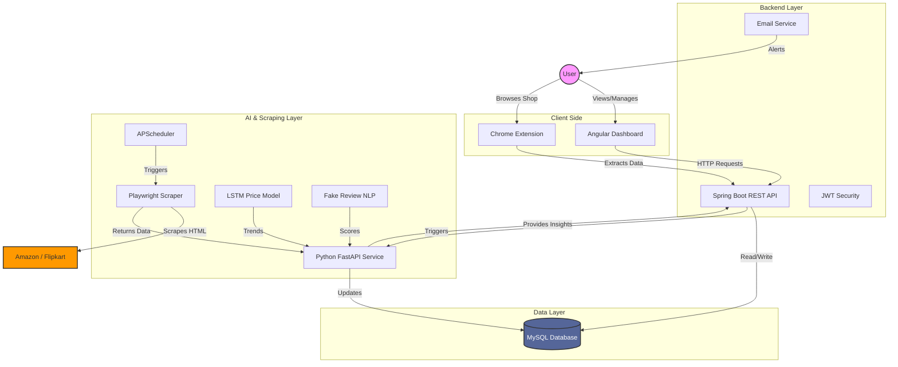

# PriceHawk System Architecture

## 🔄 System Data Flow

## 🧩 Module Interaction Detail

### 1. Data Ingestion Flow
1. **Trigger**: User views product (Extension) OR Scheduler runs (AI Service).
2. **Action**: `Scraper` fetches HTML from Amazon/Flipkart.
3. **Processing**: Data extracted -> Sent to `AI Service`.
4. **Storage**: `AI Service` updates `Products` and `PriceHistory` tables in MySQL.

### 2. User Interaction Flow
1. **Login**: User logs in via Angular (`/api/auth/signin`).
2. **Dashboard**: Fetches products (`/api/products`).
3. **Comparison**: Frontend requests `/api/products/{id}/best-deal`.
4. **Logic**: Backend compares prices in DB and returns the best option.

### 3. Notification Flow
1. **Trigger**: Scheduler updates a price.
2. **Check**: Backend checks `Watchlist` table for `current_price <= target_price`.
3. **Action**: `EmailService` sends HTML email via JavaMail.
